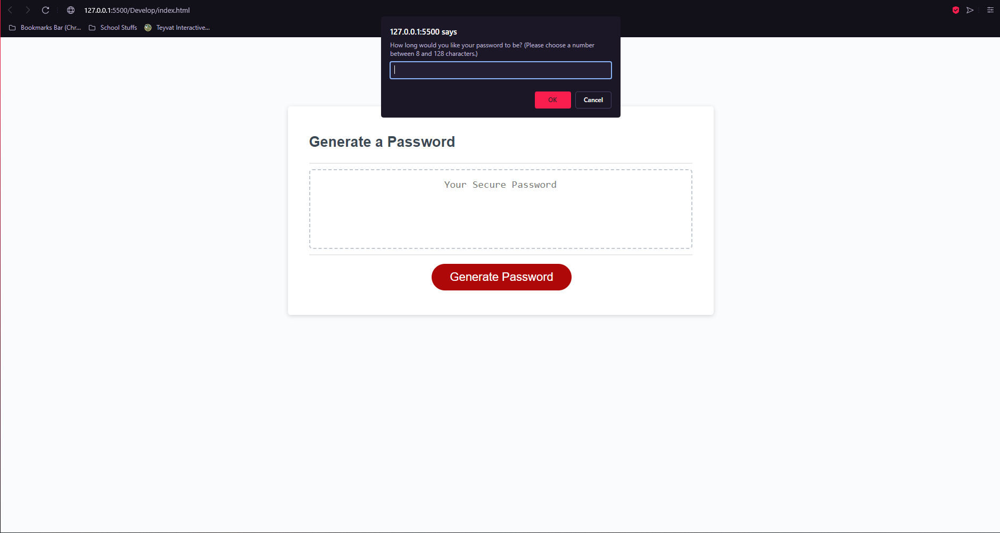

# UM Coding Bootcamp Module 3 Challenge

## Password Generator

## User Story

```
AS AN employee with access to sensitive data
I WANT to randomly generate a password that meets certain criteria
SO THAT I can create a strong password that provides greater security
```

## Acceptance Criteria

```
GIVEN I need a new, secure password
WHEN I click the button to generate a password
THEN I am presented with a series of prompts for password criteria
WHEN prompted for password criteria
THEN I select which criteria to include in the password
WHEN prompted for the length of the password
THEN I choose a length of at least 8 characters and no more than 128 characters
WHEN asked for character types to include in the password
THEN I confirm whether or not to include lowercase, uppercase, numeric, and/or special characters
WHEN I answer each prompt
THEN my input should be validated and at least one character type should be selected
WHEN all prompts are answered
THEN a password is generated that matches the selected criteria
WHEN the password is generated
THEN the password is either displayed in an alert or written to the page
```
## Usage

Once loaded into the page, you will find a large red button that says "generate password".
Once clicked on, an alert will pop up asking the user to choose the length of their password.
After choosing your password's length, you will then receive four consecutive prompts asking if you would like the password to contain Capital letters, Lowercase letters, Numbers, and Special Characters.
Once the user has made their choices, the random password will appear in the box in the center of the screen!

## Screenshot



## Deployed wepbage

The page has been deployed at: https://scriptmatcha.github.io/password-generator-fixed/
